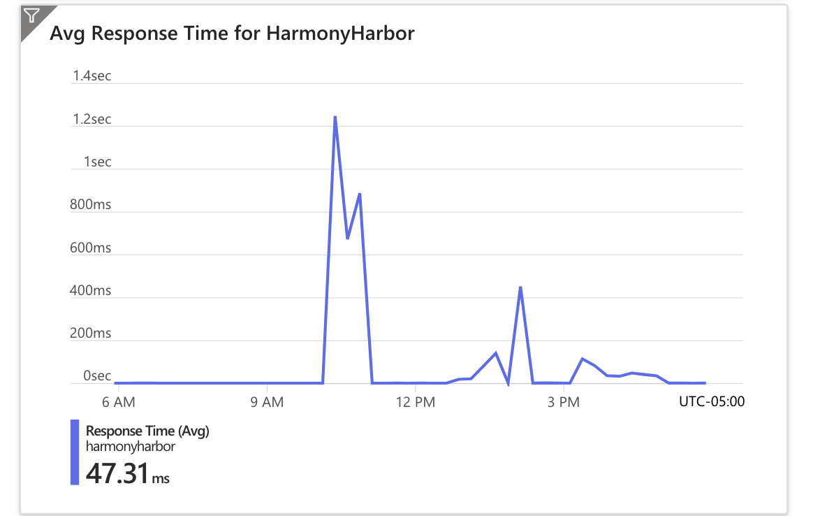

# Harmony Harbor

[](https://github.com/minlingz/HarmonyHarbor/actions/workflows/python-app.yml)

[](https://github.com/minlingz/HarmonyHarbor/actions/workflows/main_HarmonyHarbor.yml)

[Link](https://harmonyharbor.azurewebsites.net/)

:musical_note: Welcome to the Harmony Harbor service! We offer a microservice-based web application capable of analyzing and adapting to the latest music trends to suit your taste. 

:heart_on_fire: Discover a new way of exploring music with Harmony Harbor, where we transform the experience of finding your next favorite song. Dive into our vast collection of over 100,000 tracks and tailor your listening to fit exactly how you're feeling or what you're doing.

- Fine-tune your search with filters like tempo, song duration, or time signature to find music that resonates with your current activity or mood, from a morning jog to a relaxed evening or those quiet moments lost in a book.

- Interact with our intuitive chatbox that understands your emotions and preferences. Simply express how you feel, like "I'm feeling upbeat," and get three song recommendations with explanations on why they're the perfect fit for you.

:bar_chart: Our analytical tools go beyond basic playlists; we provide insightful analyses into music trends. Discover how song duration and tempo have evolved through the years, reflecting shifts in musical styles. Explore our unique radar charts that profile top artists, contrasting aspects such as average song duration, tempo, and time signature, to reveal the distinctive musical imprint of each artist in their creations.

:hammer_and_pick: Built with Python and Databricks, our service features a containerized approach with Container Registry for security, efficient data handling with top-notch libraries like Spark and Pandas, and robust infrastructure management via IaC tools. Dive into our high-performance service, and enjoy seamless updates through our CI/CD pipeline.

## Contributors

:sparkles: Thanks goes to these wonderful people 

- [Meixiang Du](link): the idea juggler and project wrangler
- [Lin Hui](https://github.com/linhui7): the data whisperer and design Picasso
- [Lisa Wang](https://github.com/lisawym): the API ninja and our ever-ready helper
- [Minling Zhou](https://github.com/minlingz): our very own CTO, Sherlock Holmes with a debugger
- Copilot: our AI assistant and documentation expert

## Architecture Diagram


## Technologies Used

- **Data Analysis and Visualization:** Pandas, NumPy, Matplotlib, Seaborn
- **Containerization and Deployment:** Docker, Azure Container Registry, Azure App Service
- **Big Data and Analytics:** Azure Databricks, Spark SQL, delta tables
- **Security and Identity Management:** Azure Key Vault, Azure Active Directory
- **Infrastructure as Code:** Azure Resource Manager (ARM) templates
- **Version Control and CI/CD:** GitHub Actions, GitHub Secrets, GitHub Codespaces
- **AI and Natural Language Processing:** OpenAI API
- **Load Testing:** Locust

## Microservices

### Harmony Harbor Microservice

* `Statistics` Microservice - It returns the SQL query results from the Delta Lake table `prepared_song_data` in Azure Databricks. It uses the `requests` library to make HTTP requests to the Azure Databricks REST API.

* `Chatbot` Microservice - It returns the song recommendations based on the user input. It uses the `requests` library to make HTTP requests to the OpenAI API.

### File Structure
* `app.py`: This file contains the code for the Harmony Harbor service. It uses the Flask framework to handle the HTTP requests and responses.
    ```python
    from flask import Flask, request, jsonify
    app = Flask(__name__)
    ```
* `requirements.txt`: This file contains the Python dependencies for the Harmony Harbor service. It uses the `requests` library to make HTTP requests to the OpenAI API.
    ```text
    flask==3.0.0
    black==23.3.0
    ruff==0.0.285
    requests==2.31.0
    azure-identity
    azure-keyvault-secrets
    openai
    ```
* `Dockerfile`: This file is used to build the Docker image for the Harmony Harbor service. It uses the Python base image, installs the Python dependencies, and copies the source code into the image.

### Use of logging
* `app.py`: This file contains the code for logging in the Harmony Harbor service. It uses the Python logging module to log the requests and responses.
    ```python
    logging.basicConfig(filename="app.log", level=logging.ERROR)
    ```

    Example of log entry in `app.log`:

    

* Azure App Serfvices: We use Azure web app to host our service. It provides a centralized location for all our logs, with support for log streaming and log analysis.

    Example of log stream in Azure app service:
    
    

### Containerization
* `Dockerfile`: This file is used to build the Docker image for the Harmony Harbor service. It uses the Python base image, installs the Python dependencies, and copies the source code into the image.
    ```dockerfile
    FROM python:3.9
    WORKDIR /app
    COPY requirements.txt /app
    RUN pip install -r requirements.txt
    COPY . /app
    EXPOSE 9000
    ENV LANG C.UTF-8
    CMD ["python", "app.py"]
    ```
### Autoscaling
We use Azure App Service to host our service. It provides autoscaling capabilities, with support for autoscaling based on CPU percentage, memory usage, and HTTP queue length.

## Data Engineering

All notebooks are under `Notebooks` folder.

Our dataset is a subset of the Million Song Dataset, a collection of features and metadata for contemporary music tracks. It is available in the sample datasets included in the Databricks workspace. 

Below is a list of fields we included with each track in the database:
- Artist Name
- Duration
- Release
- Tempo
- Time Signature
- Title
- Year

The ETL pipeline leverages Databricks features to explore and process a raw dataset, utilizing Databricks notebooks to ingest, transform, and load the data into target tables. Additionally, it incorporates error handling, data validation, and automation through a Databricks job for streamlined data processing and visualization.

The transformed data is stored as Delta Lake file, as it's a reliable form with high performance.

Spark SQL offers high-performance, scalable data processing across diverse sources, with seamless integration in the Apache Spark ecosystem. 

AI tools, such as Copilot and ChatGPT, played a crucial role in streamlining the ETL pipeline by providing valuable insights and recommendations on data cleaning techniques, effective error handling strategies, and the selection of appropriate graph types for data analysis. These tools significantly enhanced the efficiency and quality of the data processing workflow, ultimately leading to more informed and accurate decision-making

## Data Science
We have two intriguing findings that stand out from a data science perspective.


The first finding, depicted in a radar chart, encapsulates the distinctive musical signatures of various top artists by comparing average song duration, tempo, and time signature. This visual distillation demonstrates how data can unravel the unique stylistic elements that define an artist's body of work.


The second revelation comes from a line chart that traces the ebb and flow of song characteristics through the ages. It charts the average duration and tempo of songs, offering a historical lens on how music has adapted to cultural currents and technological advancements from 1925 to 2010. This trend analysis is a testament to data science's capacity to chronicle and interpret the shifting tides of artistic expression.

## LLM

* Integrated `ChatGPT 3.5 Turbo` for language processing by inplementing a chatbot using `OpenAI API` package.
* Developed a recommendation system for song suggestions, utilizing `prompt engineering` to refine user input.
* Created a visually appealing webpage with` HTML`, `CSS`, and `JavaScript`, ensuring responsiveness and user-friendliness.
* Collaborated with `Midjourney` to generate illustrations and integrated visually appealing graphics for a better user experience.

## Load Testing

* Conducted load tests using `Locust` library on webpages and endpoints requesting data from OpenAI API and Databricks API. Assigned different weights to simulate real-world user request distribution.
* Performed tests with 200, 500, and 1000 users at 1, 5, and 15 minutes durations. Diagnosed application performance, observing no failures and meeting expectations in response time and requests per second.
* Identified longer response times and lower load tolerance for external API traffic, signaling the need for optimization.
* Automated load test scripts generate and store result metrics in a subfolder. Integrated load tests into the CI/CD pipeline for automatic testing with each code change and new Docker image creation.



* Web app hosted on Azure cloud with scaling capacity, adjusting quotas based on load.
* Utilized Azure Web App Service metrics board for monitoring performance. Overall, the application handled 60k responses in 5 hours with an average response time consistently below 0.1 seconds. CPU and memory usage are also monitored.

## Infrastructure as Code (IaC)

### File
* `ExportedTemplate-706final.zip`: This file contains the ARM template for the Harmony Harbor service that are hosted in Azure Resource Group. It defines the resources to be deployed, their configurations, and the relationships between them.
* `parameters.json`: This file contains the parameters for the Harmony Harbor service that are hosted in Azure Resource Group. It defines the parameters for the resources to be deployed.
* `template.json`: This file contains the template for the Harmony Harbor service that are hosted in Azure Resource Group. It defines the resources to be deployed, their configurations, and the relationships between them.

Here is the list of resources we deployed in Azure Resource Group:


Utilize an Infrastructure as Code (IaC) solution for infrastructure setup and management in Azure with Resource Manager (ARM) templates.

IaC standardizes infrastructure deployment, fostering rapid, error-free scaling and collaboration through version control. This approach streamlines operations, optimizes costs, and ensures robust security and disaster recovery measures.

Azure provides several tools and services for IaC, with Azure Resource Manager (ARM) templates being the primary choice. ARM templates are JSON files that define the resources you want to deploy, their configurations, and the relationships between them.

Using Infrastructure as Code (IaC) in Azure allows us to automate the provisioning and management of our infrastructure.

* Create a template`template.json` that includes App Service, App Service Plan, Application Insights, and deployments for HarmonyHarbor under the Harmony Harbor resource group.
* Set parameters `parameters.json`for the above resources as needed.
* Deploy using Azure Custom deployment, using JSON templates and parameters.


## Continuous Integration and Continuous Delivery (CI/CD)
We use GitHub Actions to implement Continuous Integration and Continuous Delivery (CI/CD) for our service. It provides a workflow to automate the build, test, and deployment of our application.
* Python package: `python-app.yml` - This workflow will run every time a new commit is pushed to main branch. It will install the dependencies, format and lint the code, run the tests, and upload the test results to GitHub.
* Build and deploy container app to Azure Web App: `main_HarmonyHarbor.yml` - This workflow will run every time a new commit is pushed to main branch. It will build the container image, push it to Azure Container Registry, and deploy it to Azure App Service.

## GitHub Configurations
### Github Actions
We implemented two workflows in GitHub Actions:
* `python-app.yml`: This workflow will run every time a new commit is pushed to main branch. It will install the dependencies, format and lint the code, run the tests, and upload the test results to GitHub.
* `main_HarmonyHarbor.yml`: This workflow will run every time a new commit is pushed to main branch. It will build the container image, push it to Azure Container Registry, and deploy it to Azure App Service.

### Guthub Secrets
* `AzureAppService_ContainerUsername_9be46abaa20344908e13ba6bbe4d7065`: The username for the Azure App Service container registry.
* `AzureAppService_ContainerPassword_aac379ebce6247ab9f1ca5883053939f`: The password for the Azure App Service container registry.

### Github Codespaces
* `devcontainer.json`: This file is used to configure the Codespace. It specifies the `Dockerfile` to use, the extensions to install through `requirements.txt`, and the commands to run when the Codespace is created.
* `launch.json`: This file is used to configure the debugger. It specifies the Python interpreter to use and the environment variables to set.

## Security 
The security of our service is ensured by the following measures:
* `Container Registry`: We use Azure Container Registry to store and manage our container images. It provides a private registry for our Docker container images, with support for all types of container deployments. It integrates with Azure Container Instances, it also supports Azure Active Directory for authentication, so we can control who has access to our images.
* `Azure Key Vault`: We use Azure Key Vault to store and manage our application API tokens integrated with Azure Databricks and OpenAI. It provides centralized key management, with access control, auditing, and logging features. It also integrates with Azure Active Directory for authentication, so we can control who has access to our secrets.

    Python code example in `app.py` to access Azure Key Vault:
    ```python
        key_vault_url = "https://dek.vault.azure.net/"
        credential = DefaultAzureCredential()
        secret_client = SecretClient(vault_url=key_vault_url, credential=credential)
        secret_value = secret_client.get_secret("HLDB").value
    ```
* `Azure Active Directory`: We use Azure Active Directory to manage our users and applications. It provides centralized identity management, with support for multi-factor authentication, single sign-on, and more. It also integrates with Azure Key Vault for authentication, so we can control who has access to our secrets. We created a user group `usergroup_harmonyharbor` and added all our team members to the group. We then granted the group access to the Azure resource group `706final`.
* `Github Secrets`: We use Github Secrets to store and manage our application secrets required by CI/CD pipeline with Azure Deployment Center. It provides centralized key management, with access control, auditing, and logging features. It also integrates with Azure Active Directory for authentication, so we can control who has access to our secrets.

    Github workflow example in `main_HarmonyHarbor.yml` in our code access Github Secrets:
    ```yaml
        - name: Log in to registry
        uses: docker/login-action@v2
        with:
            registry: https://706registry.azurecr.io/
            username: ${{ secrets.AzureAppService_ContainerUsername_9be46abaa20344908e13ba6bbe4d7065 }}
            password: ${{ secrets.AzureAppService_ContainerPassword_aac379ebce6247ab9f1ca5883053939f }}
    ```

## Video Demo
https://youtu.be/52EF1nJgdME
